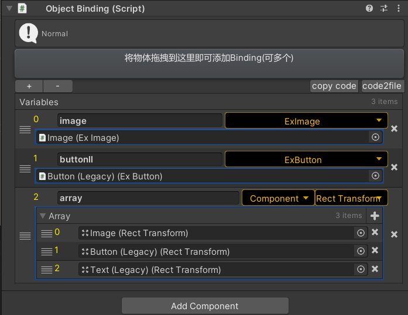

# ObjectBinding

Unity组件绑定存储组件，适用于UI、场景、或者其他情景下的组件绑定。

### Insepctor面板



### c#使用

使用生成模板代码的方式来使用，一个生成的示例代码如下：

```c#
#region Template Generate,don't modify
protected partial class UIB_UILogin
{
    #region ObjectBinding Generate 
    public UniFan.ExImage image { protected set; get; }
    public UniFan.ExButton button { protected set; get; }
    protected virtual void InitBinding(ObjectBinding __binding)
    {
        var __tbv0 = __binding.GetVariableByName("image");
        this.image = __tbv0.GetValue<UniFan.ExImage>();
        var __tbv1 = __binding.GetVariableByName("button");
        this.button = __tbv1.GetValue<UniFan.ExButton>();
    }

    #endregion ObjectBinding Generate 
}
#endregion Template Generate,don't modify
```

### lua使用

可以在lua的UI窗体初始化的时候拿到这个组件，并且遍历赋值到一个lua table中，一个示例代码如下，通过`UIUtil.LuaUIBindingTable(obj,window.ui)` 就可以绑定到名叫ui的table中：

```lua
--LuaUIBinding脚本数据绑定到lua table中
--obj:GameObject
--tab:lua Table
function UIUtil.LuaUIBindingTable(obj,tab)
	if tab == nil then
		return
	end
	local uibinding = obj:GetComponent(cst_ObjectBinding)
	if IsNull(uibinding) then
		return
	end
	local vars = uibinding.Variables
	for i = 0,vars.Count-1 do
		local value = vars[i]:GetValue()
		
		--c# VariableType.Array
		if vars[i].VariableTypeInt == 11 then
			local valueTab = {}
			tab[vars[i].Name] = valueTab
			
			for i = 0, value.Length-1 do
				table.insert(valueTab,value[i]:GetValue())
			end
			
		else
			tab[vars[i].Name] = value
		end
	end
end
```


