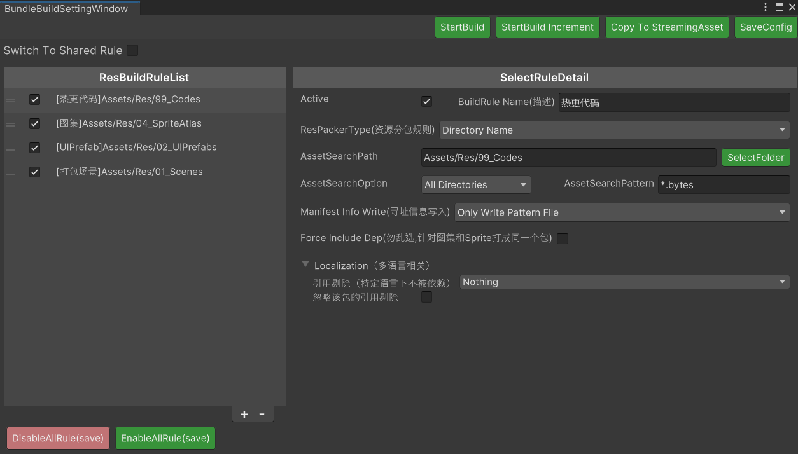

# unifantasy
unity game framework 游戏框架，使用hybridclr作为热更方案，包括了基本架构、资源打包加载、UI框架、网络层（tcp，udp，kcp，websocket）

联系方式：

- QQ:  821869798

> 框架前身是某上线项目使用，稳定易用。但是大部分代码是经过优化和重构，是由最初lua框架改为HybridCLR热更框架，所以不敢完整保证稳定性。
>
> 项目优势：轻量级、可读性高、高性能、高可扩展性。作者不喜欢很重的框架，理念就是高性能，例如框架层内部基本上不会导致GC Alloc，能对象池就对象池，只是供给业务层的实例会创建对象。

## 使用

### 初始化项目

1. 安装HybridCLR，Unity菜单栏点击： `HybridCLR/Installer 打开面板 -> Install`

### 编辑器运行

编辑器直接运行即可，默认使用编辑器模拟模式

## 打包步骤

### 打包准备

打包前，先确保代码加载的AssetBundle资源的打包手机规则已经设定

资源框架打包AssetBundle，是根据用户的设置规则打包，可以添加或者删除(左下角的+-号)，根据项目情况自行设置好，然后保存即可，示例如下：

### 开始打包

1. **Unity切换打包平台（如果不是目标平台）**
2. **HybridCLR一键执行必要的生成操作** ：菜单栏点击 `HybridCLR/Generate/All`  命令运行过程中会执行一次导出工程，以生成裁剪后的AOT dll。可能耗时比较长
3. **HybridCLR程序集生成以及拷贝** ：菜单栏点击`HybridCLR/BuildCodesAndCopy` 执行Build dll以及拷贝到工程内的资源打包目录
4. **打包AssetBundle**：菜单栏点击 `GameEditor/AssetBundle/StartBuild` 根据预设的AB收集打包规则执行ab打包，最终会生成到和Assets同级的AssetBundles目录中，以及可选是否拷贝到StreamingAssets目录下，也就是把资源放入包内。或者是资源不跟包走网络下载，自由选择。
5. **拷贝资源（可选）**：第三步打包是也会弹框询问，如果还需要手动拷贝，可以选择菜单栏 `GameEditor/AssetBundle/Copy AssetBundles to StreamingAssets` 
6. **执行打包**：正常Unity打包就可以了
