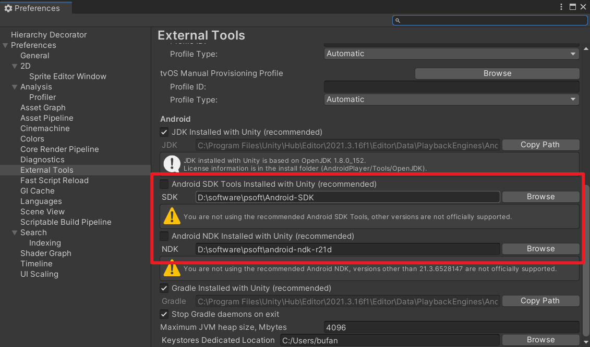
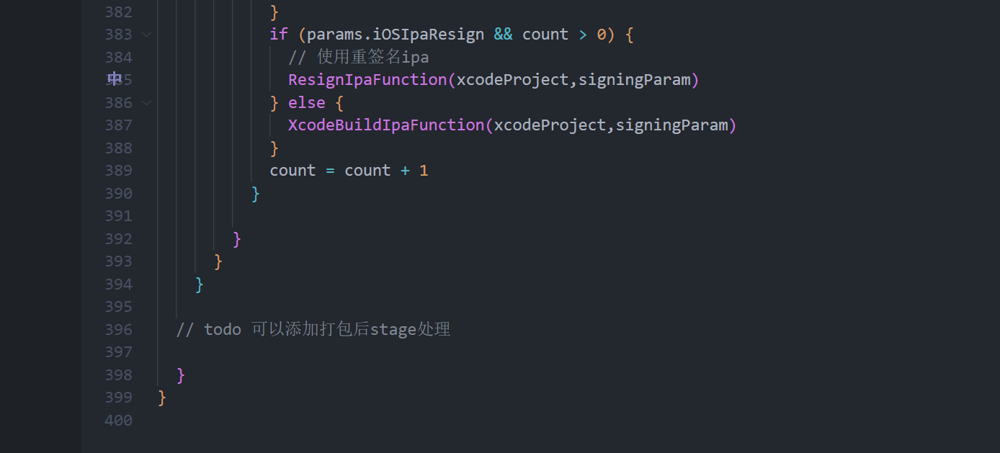

# 自动打包

介绍

1. 如何使用自己电脑下的工程自动打包
2. 部署Jenkins到打包机来远程自动打包

其中Jenkins自动打包更为灵活，支持所有打包参数。

# 环境准备

- Unity2021.3.x，如果需要打PC包，需要安装Unity的il2cpp支持模块（Windows MacOS都有该模块），HybridCLR需要依赖il2cpp
- Android-SDK
- Android-NDK



如图上所示，在Unity的Preference中设置好对应的SDK和NDK路径

# Unity编辑器中自动打包

如果想用自动电脑打包的情况下，可以用Unity打开工程，按如下步骤打包，只需要点一下就能解放双手。

## 准备工作

- 开启包内音视频模式：编辑器菜单栏 GameEditor ->  Media Buildin Mode

## Unity打包

点击GameEditor -> AutoBuild -> 对应的打包平台即可

> 注意尽量不要在同一个工程中打不同平台，资源多了切平台很慢，建议拉取多个工程对应Trunk-Android Trunk-Windows Trunk-iOS这样。 


# Jenkins自动打包

Jenkins自动打开部署在打包机上，就可以远程全自动打包，不需要占用自己的电脑了。

**注意也需要在部署Jenkins的电脑上，进行本篇《环境准备》前置工作**

>  **对应使用Windows和MacOS部署Jenkins的自动打包都是通用的，其中Windows可以打包Windows PC包和Android包，MacOS可以打包iOS包和Android。**
>
> 其中MacOS本来是可以打Windows PC包的，但是因为仅支持Mono模式的PC包，HybridCLR是基于il2cpp的，所以就不行了


## 部署jenkins

- [jenkins.war](https://www.jenkins.io/download/) 可以从连接下在jenkins.war包，注意要选择Generic Java package (.war)下载，这个是通用的，不要选Windows版本。
- jdk环境。**不能使用jdk8，jdk8已经不被jenkins支持，一些插件兼容性也可能有问题。**可以去官网下载最新的jdk21,[Java Downloads | Oracle](https://www.oracle.com/java/technologies/downloads/#java21)

- jdk的bin路径添加到环境变量中

## 启动Jenkins

首先需要在jenkins.war文件所在目录打开终端。

- Windows启动jenkins命令

```shell
# Powershell用这一行
$env:JAVA_TOOL_OPTIONS="-Dfile.encoding=UTF-8"; java -jar jenkins.war
# cmd用这一行
set JAVA_TOOL_OPTIONS=-Dfile.encoding=UTF-8 & java -jar jenkins.war
```

- MacOS启动jenkins命令

```
java -jar jenkins.war
```

## 设置Jenkins

### 首次启动

第一次启动完毕后，浏览器进入http://127.0.0.1:8080/ 访问Jenkins，输入默认的管理员密码，启动终端上会有密码。

然后安装默认推荐的的插件就行了，这里面的推荐插件有些就是自动打包依赖的。

接着就是让创建一个管理员用户，这个自行创建就行了。

**接着是Jenkins URL配置，就是访问地址，上面默认是127.0.0.1:8080，需要改成内网地址，否则别人电脑不能访问**

### Jenkins必备插件安装

进入Jenkins面板后，需要先装上一些自动打包必须的插件。点击左侧面板 Manager Jenkins -> System Configuration -> Plugins。再点击左侧的Available plugins，输入插件的名字就可以安装了。

- Subversion：svn支持，可选，根据需求
- Extended Choice Parameter： 更强大的参数支持

- Job DSL：能够使用groovy脚本灵活的维护构建

### Jenkins首次的设置项

**关闭Job DSL的安全选项**

Manager Jenkins -> Security -> Security。找到Enable script security for Job DSL scripts选项，并且取消勾选，然后保存。注意这个选项要安装了Job DSL插件后才会显示。


**添加Unity执行文件路径**

Manager Jenkins -> System。找到全局属性一栏，添加Unity执行文件的环境变量，然后保存。

key: Unity2021

value: 根据自己电脑的Unity.exe所在目录填写。Windows写到Unity.exe，MacOS需要写到Unity.app/Contents/MacOS/Unity


## 创建DSL Pipeline构建

>  DSL Pipeline构建是用来批量创建和更新构建的，比传统的方式维护性更为便捷，特别是要维护多个分支打包项，每个分支Windows Android iOS，以及多台打包机Jenkins维护。传统的配置方式很难应付，DSL就是可以批量管理，解决这一问题的。

首先找到本git工程下的scripts/create_jobs_pipeline.groovy脚本，打开并且复制内容。

点击Jenkins左侧面板的新建Item，输入名字，选择Pipeline的方式，然后点击确定


把之前复制的脚本复制到Pipeline script的编辑框中


其中dslParams中的参数可以根据自己的需要修改，其中dsl_pipelineName是构建的名字，

dsl_scmUrl是构建的分支。svn分支的格式是`svn://url`。git分支的格式是`https://url-xxx.xxx.git|master`使用|分割分支

接着点击保存。

## 使用DSL Piepline维护Unity自动打包Jobs


点击Build Now之后，回到主页可以看到面板上多个多个jobs


**之后如果构建的groovy脚本更新，需要更新这些job时，可以再次运行create-unity-build-job，也就是DSL的维护遍历性，程序只需要更新groovy脚本上传到git仓库，使用Jenkins的人就可以批量的更新这些Unity自动打包的job**

## 使用Jenkins来自动打包

以打包Android举例，点击trunk-Android,然后点击`Build with Parameters`,根据自己需求改动参数（截图没显示全参数，参数也可以扩展），然后点击Build就可以出包了。首次打包会需要更多时间，因为涉及拉取工程，以及Unity导入工程很耗时。

推荐的使用情景是：打包机挂载局域网共享硬盘到本地磁盘，outputPath设置到这个共享磁盘中，这样打包机打完，只需要在自己电脑上去这个共享局域网磁盘取包就行了。


构建时，面板上可以看到流水线构建过程，点击下图中框选区域的随意一个流水线块可以看到日志，也可以按下图箭头点击构建号，左侧面板有个`Console Output`可以看到详细日志


## TODO 

后续需要根据项目扩展unity_pipeline.groovy脚本，比如打包后的处理，XCode命令行（有pipeline插件或者直接调命令行）打包iOS的ipa包，以及添加热更资源的构建groovy脚本。

